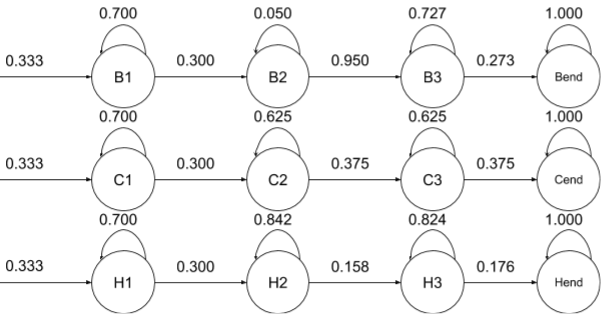

# Assignment 6 (on campus): Hidden Markov Models

## Setup
Clone this repository:

`git clone https://github.gatech.edu/omscs6601/assignment_6_oncampus.git`

The submission scripts depend on the presence of 3 python packages - `requests`, `future`, and `nelson`. Install them using the command below:

`pip install -r requirements.txt`

Python 2.7 is recommended and has been tested.

Read [setup.md](./setup.md) for more information on how to effectively manage your git repository and troubleshooting information.

## Overview
Hidden Markov Models are used extensively in Artificial Intelligence, Pattern Recognition, Computer Vision, and many other computer fields.  If a system has unobservable (hidden) states and each state is independent of the prior, then we can create a model of that system using probability distributions over a sequence of observations.  The idea is that we can provide this system with a series of observations to use to query what is the most likely sequence of states that generated these observations.

### Due Date
This assignment is due on December 4th 2018 at 11:59PM UTC-12 (Anywhere on Earth). Note that the final exam will be released on December 2nd midnight, so we suggest finishing this assignment quickly so as not to have too many deadlines pressing at the same time.

The deliverables for the assignment are:

* All functions completed in **_hmm_submission.py_**

### The Files

You will only have to edit and submit **_hmm_submission.py_**, but here are all the notable files:
1. **_hmm_submission.py_**: Where you will construct your probabilities and viterbi trellis.
2. **_hmm_submission_tests.py_**:  Local test file.  Due to static nature of the trellis values, local tests are extremely limited.  Please do not share values or probabilities with other students if you create your own tests.

## Submission
All submissions will be via Bonnie. Execute `python submit.py` to send your submission file.  It is recommended to run this command from a shell/command prompt as issues have been known while running inside select IDEs.

#### A total of 10 submissions is allowed. We will take the LAST submission as your final submission.

Please also submit your hmm_submission.py to Canvas as backup.

### Imports
- All Standard Python 2 modules
- Numpy

### Resources
1. Udacity Lectures on [Pattern Recognition Through Time (Lesson 8)](https://classroom.udacity.com/courses/ud954/lessons/5829639927/concepts/66950604320923)
2. Challenge Questions 22-24 on Piazza

## The Assignment
The goal of this assignment is to demonstrate the power of probabalistic models. You will build a word recognizer for American Sign Language (ASL) video sequences. In particular, this project employs [hidden Markov models (HMM's)](https://en.wikipedia.org/wiki/Hidden_Markov_model) to analyze a series of measurements taken from videos of American Sign Language (ASL) collected for research (see the [RWTH-BOSTON-104 Database](http://www-i6.informatik.rwth-aachen.de/~dreuw/database-rwth-boston-104.php)).

In each video, there's an ASL signer signing a meaningful sentence in ASL. You are given the XY coordinates of the speaker's left hand, right hand and nose for every frame. The following diagram shows how the positions of the left hand (Red), right hand (Blue), and nose (Green) change over time in video number #66. Saturation of colors represents time elapsed.

In this assignment, for the sake of simplicity, you will only use the Y-coordinates to construct your HMM. In Part 1 you will build a one dimensional model, recognizing words based only on a series of right-hand Y coordinates; In Part 2 you will go multidimensional, and at each time step (frame) you will have two observed coordinates, representing right hand & left hand Y positions at that frame.

### Part 1a: Encoding the HMM
_[10 Points]_

Follow the method taught on Udacity **Lecture 8: 29. HMM Training** to determine following values for each word:
1. the transition probabilities of each state
2. the mean & standard deviation of emission Gaussian distribution of each state

Use the training samples from the table below. Provide the transition, prior, and emission probabilities parameters for all three words with **accuracy to 3 decimal digits**.

Round the values to 3 decimal places thoughout entire assignment:
- 0.1 stays 0.1 or 0.100
- 0.1234 rounds to 0.123
- 0.2345 rounds to 0.235
- 0.3456 rounds to 0.346
- 0.0123 rounds to 0.012
- 0.0125 rounds to 0.013

Those values can be hardcoded in your program. Don't use round() from python.

Word | Frames | Observed sequence
--- | --- | --- 
BUY | 6 | 36, 44, 52, 56, 49, 44 
BUY | 8 | 42, 46, 54, 62, 68, 65, 60, 56
BUY | 10 | 42, 40, 41, 43, 52, 55, 59, 60, 55, 47
CAR | 10 | 47, 39, 32, 34, 36, 42, 42, 42, 34, 25
CAR | 9 | 35, 35, 43, 46, 52, 52, 56, 49, 45
CAR | 8 | 28, 35, 46, 46, 48, 43, 43, 40
HOUSE| 15 | 37, 36, 32, 26, 26, 25, 23, 22, 21, 39, 48, 60, 70, 74, 77
HOUSE| 15 | 50, 50, 49, 47, 39, 39, 38, 38, 50, 56, 61, 67, 67, 67, 67
HOUSE| 16 | 45, 43, 44, 43, 40, 35, 36, 37, 39, 45, 60, 68, 66, 72, 72, 75

As shown in the diagram below, each one of the three words (BUY, CAR, and HOUSE) has exactly **THREE hidden states** in its HMM. All words must start from State 1 and can only transit to the next state or stay in the current one.

### _Training sequences need to have 3 hidden states no matter what!_
If you follow the procedure on the Udacity lecture video, you might encounter a situation where a hidden state is **_squeezed_** out by an adjacent state. In that situation, always keep at least one observation for that hidden state.

Example:
Assume you've reached a stage where the following is true: 
- State 1 has mean=53 & std=6
- State 2 has mean=37 & std=9
- State 3 has mean=70 & std=8

The next training sample has the following observed sequence:

`45 45 34 | 30 30 25 36 52 | 62 69 74` 

and you are trying to adjust the location of state boundary between State 1 & 2. You first move it 1 step to the left since 34 is closer to State 2, and then you realize that 45 is still closer to State 2. If you follow the same routine, you will end up with no obvervation for State 1. In order to prevent this from happening, you have to stop at 45 and as a result leave the boundary as 

`45 45 | 34 30 30 25 36 52 | 62 69 74`

Now you meet the '3 hidden states per sample' requirement.

#### Functions to complete:
1. `part_1_a()`

---

### Part 1b: Creating the Viterbi Trellis
_[40 Points]_

The goal here will be to use the HMM derived from Part 1a (states, prior probabilities, transition probabilities, and parameters of emission distribution) to build a viterbi trellis.  When provided with an evidence vector (list of observed right-hand Y coordinates), the function will return the most likely sequence of states that generated the evidence and the probabilty of that sequence being correct.

For example, an evidence vector [36, 44, 52, 53, 49, 44] should output a sequence ['B1', ... 'B2', ... 'B3']

If no sequence can be found, the algorithm should return one of the following tuples:
`(None, 0)` (null),  `([], 0)` (empty list) or  `(['C1', 'C1', ... 'C1'],0)` (Or all being the first state of that letter)

"No sequence can be found" means the probability reaches 0 midway. If you find an incomplete sequence with some probability, output that sequence with its probability. 

#### Functions to complete:
1. `viterbi()`

#### Hint:
In order to reconstruct your most-likely path after running Viterbi, you'll need to keep track of a back-pointer at each state, which directs you to that state's most-likely predecessor.

You are asked to use the provided function `gaussian_prob` to compute  emission probabilities. Although in real work, you have to convert the probability to log-base in order to prevent digit underflow, in this assignemnt however, we will only test your function against a rather short sequence of observations, so **DO NOT** convert the probability to logarithmic probability, otherwise you might fail to pass the unittests on Bonnie.

#### Bonnie Notes:
In the autograder, we will also test your code against other `evidence_vectors`.

----

### Part2a: Multidimensional Output Probabilities
_[5 Points]_

In Part 1a, we use only right-hand Y-axis coordinates as our solely feature, now we are going to use both hands. Since sign language is two handed, using features both to the right and left hands can increase the accuracy of our model when dealing with more complex sentences.

Here you are given with the transition probabilities, and the means & standard deviations for emission probabilties of left-hand Y-axis locations, following the same procedure conducted in Part 1a.

One thing to notice is, in Part 1, the `viterbi` function is tested against single words. In other words, the input evidence vector will not transit between different words. However, for Part 2, the input evidence vector can be either a single word, or a verb phrase such as "BUY CAR" and "BUY HOUSE". Adjust the given probabilities to adapt this fact.

BUY | State 1 | State 2 | State 3
--- | --- | --- | --- 
Mean | 108.200 | 78.670 | 64.182
Std | 17.314 | 1.886 | 5.573

CAR | State 1 | State 2 | State 3
--- | --- | --- | --- 
Mean | 56.300 | 37.110 | 50.000
Std | 10.659 | 4.306 | 7.826

HOUSE | State 1 | State 2 | State 3
--- | --- | --- | --- 
Mean | 53.600 | 37.168 | 74.176
Std | 7.392 | 8.875 | 8.347

#### Functions to complete:
1. `part_2_a()`

---

### Part 2b: Improveing the Viterbi Trellis
_[45 Points]_

Modify the Viterbi Trellis function to allow multiple observed values (Y location of right and left hands) for a state. You don't have to use `gaussian_prob` this time, but the return format should be identical to what you are told in Part 1b.

#### Functions to complete:
1. `multidimensional_viterbi()`

#### Bonnie Notes:
In the autograder, we will also test your code against other `evidence_vectors`.

---

**CONGRATULATIONS!**  You have just completed your final assignment for CS6601 Artificial Intelligence.

#### Bonus
Here is a piece of code that listens for a first left mouse click and starts producing a 1 or 0 every 100 milliseconds depending on whether or not the left mouse is depressed. When it senses a “return” key, the code finishes writing the binary sequence and you can close the window. The time of pressing and depressing is rounded to the nearest 100 milliseconds.

  
    from Tkinter import *
    import sys
    import time

    message=''
    key_start=-1
    space_start=-1

    def press(event):
        global message,key_start,space_start
        times=0
        if space_start>0:
            times=int(round((time.time()-space_start)*10))
        key_start=time.time()
        for i in range(times):
            message+='0,'
            msg.insert(END,'0,')

     def depress(event):   
        global message,key_start,space_start
        times=0
        if key_start>0:	
            times=int(round((time.time()-key_start)*10))
        space_start=time.time()
        for i in range(times):
            message+='1,'
            msg.insert(END,'1,')

    def end(event):
        global message
        print message

    root=Tk()

    msg=Text(root)
    msg.pack()
    msg.config(font=('times',20))
    button=Button(root,text="press me")
    button.pack()
    button.bind('<Button-1>',press)
    button.bind('<ButtonRelease-1>',depress)
    root.bind('<Return>',end)
    mainloop()

The program provided will open a new window and the unit time is 100 milliseconds. The duration of pressing and lifting is rounded to the nearest 100 milliseconds. Use this program (and your skill as a Morse code keyer) to generate a few strings of 0s and 1s that represent words in Morse code. Please note the temporal variability of human input. For example, SOS’s morse code is ... --- ... , but the user’s input might be 11100110011100011111100111111100111111001101110011.

Finish creating HMMs for the rest of the letters of the Morse alphabet. Show that your Viterbi decoder for Morse can successfully decode the examples you made above (or at least get close). You may have to tune the transition probabilities to get reliable results. Include your binary strings and your decodings of them. Below are two webpages that you might find useful: [Morse code generator in Python](http://code.activestate.com/recipes/578411-a-complete-morse-code-generator-in-python-with-sou/), [Markov chain in English letter](http://www.prooffreader.com/2014/09/how-often-does-given-letter-follow.html).

Besides the decoder, you also need to submit a string (only alphabets and spaces) and its morse code equivalent as performed by a human (in 0s and 1s). It should be a sentence of normal length and should be a real English sentence (comprised of real English words).

Your code will be tested against our string and strings submitted by other students. The decoder that gets the best results wins the competition. We will have no noise in the system. Temporal variability means that dots can be different lengths "1" vs. "11" vs "111" and dashes can be different lengths "11111" vs. "1111111" vs. "1111111" but the system still decodes properly. For our test sentences, we will make sure that the dots and dashes have some variability in them but still maintain that a dot is approximately 1/3 the size of the dash.

    def decoder(evidence_vector):
        #you can define your prior, emission, transition probabilities in your own format
        #sequence: like "A BC"
        return sequence
        
    def extra_credit():
        #string: like "A BC"
        #morse_code_equivalent: like [1,0,1]
        return string, morse_code_equivalent
